# 📘 แผนธุรกิจ Goods Japan (กูดส์ เจแปน)
## คู่มือผู้ประกอบการฉบับสมบูรณ์ — ร้านขายของมือสองญี่ปุ่น

> **ที่ตั้ง:** คลองสี่ คลองหลวง ปทุมธานี
> **รูปแบบ:** หุ้นส่วน | **จัดทำ:** กันยายน 2569
> **เอกสารนี้จัดทำจาก:** ข้อมูลแบบสอบถามหุ้นส่วน + การวิจัยตลาด + กรณีศึกษาธุรกิจที่ประสบความสำเร็จ

---

## สารบัญ

1. [สรุปผู้บริหาร (Executive Summary)](#1-สรุปผู้บริหาร)
2. [กรณีศึกษาธุรกิจที่ประสบความสำเร็จ](#2-กรณีศึกษาธุรกิจที่ประสบความสำเร็จ)
3. [แผนการเงินและผลประกอบการ](#3-แผนการเงินและผลประกอบการ)
4. [กลยุทธ์ลดต้นทุน](#4-กลยุทธ์ลดต้นทุน)
5. [คู่มือปฏิบัติงาน — ผู้ประกอบการ](#5-คู่มือปฏิบัติงาน--ผู้ประกอบการ)
6. [คู่มือปฏิบัติงาน — พนักงาน](#6-คู่มือปฏิบัติงาน--พนักงาน)
7. [แผนการตลาดและโฆษณา](#7-แผนการตลาดและโฆษณา)
8. [แผนการออก Event / ตลาดนัด](#8-แผนการออก-event--ตลาดนัด)
9. [Checklist ก่อนเปิดร้าน](#9-checklist-ก่อนเปิดร้าน)
10. [ข้อตกลงหุ้นส่วน](#10-ข้อตกลงหุ้นส่วน)
11. [การจัดการความเสี่ยง](#11-การจัดการความเสี่ยง)
12. [แผนผังร้านและทำเลที่ตั้ง](#12-แผนผังร้านและทำเลที่ตั้ง)
13. [กลยุทธ์ระบายสินค้าค้างสต๊อก](#13-กลยุทธ์ระบายสินค้าค้างสต๊อก)
14. [การจัดการที่พักพนักงาน](#14-การจัดการที่พักพนักงาน)
15. [วิเคราะห์กลุ่มลูกค้ารอบร้าน](#15-วิเคราะห์กลุ่มลูกค้ารอบร้าน)
16. [แผนขยายกิจการระยะยาว](#16-แผนขยายกิจการระยะยาว)

---

## 1. สรุปผู้บริหาร

### วิสัยทัศน์
ร้าน Goods Japan มุ่งเป็น **แหล่งสินค้ามือสองคุณภาพดีจากญี่ปุ่น อันดับ 1 ของปทุมธานี** ผสมผสานการขายหน้าร้าน + ออนไลน์ + ตลาดนัด เพื่อเข้าถึงลูกค้าสูงสุด

### สถานะปัจจุบัน vs เป้าหมาย

| ตัวชี้วัด | ร้านเดิม (กำแพงเพชร) | เป้าหมายร้านใหม่ (เดือน 6) | เป้าหมาย (ปีที่ 1) |
|-----------|----------------------|---------------------------|-------------------|
| ยอดขาย/เดือน | ฿60,000-90,000 | ฿130,000 | ฿180,000+ |
| กำไรสุทธิ | ขาดทุน ฿10,000 | กำไร ฿15,000-25,000 | กำไร ฿40,000+ |
| ช่องทางขาย | FB + หน้าร้าน | FB + TikTok + Shopee + หน้าร้าน + ตลาดนัด | ทุกช่องทาง + Event |
| ลูกค้าประจำ | 50+ คน | 150+ คน | 300+ คน |

### Flowchart ภาพรวมธุรกิจ

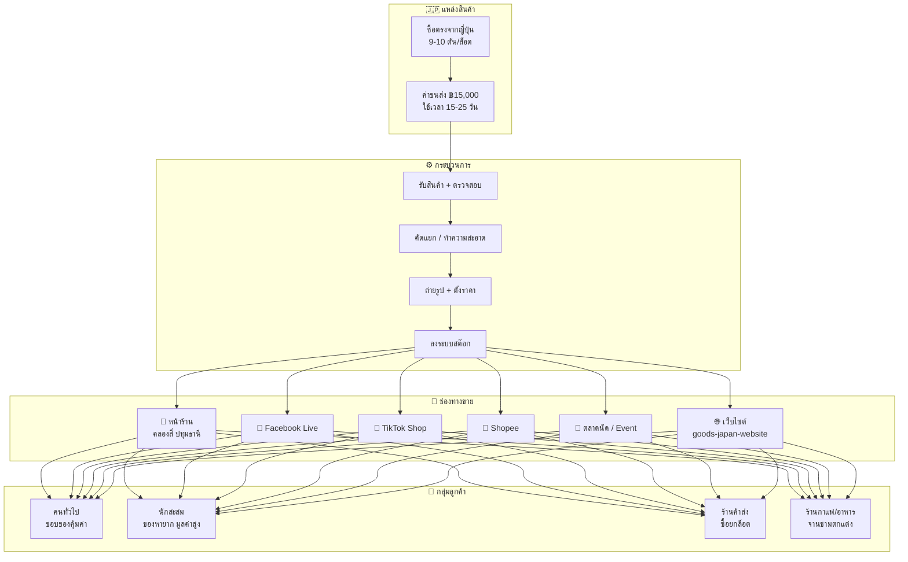

---

## 2. กรณีศึกษาธุรกิจที่ประสบความสำเร็จ

### 🇯🇵 ธุรกิจจากญี่ปุ่น

#### 2nd STREET (セカンドストリート)
| รายละเอียด | ข้อมูล |
|-----------|-------|
| **สาขา** | 1,000+ แห่งทั่วโลก (ญี่ปุ่น, สหรัฐ, ไทย) |
| **กลยุทธ์หลัก** | ระบบรับซื้อมาตรฐานสากล ประเมินราคาชัดเจน จ่ายเงินสดทันที |
| **ทำเล** | ชานเมือง — ลูกค้าขับรถมาขนของมาขายได้ง่าย |
| **บทเรียนสำหรับ Goods Japan** | ✅ สร้างระบบราคาที่ชัดเจน ✅ ทำเลชานเมืองเหมาะกับสินค้าชิ้นใหญ่ |

#### HARD OFF / BOOK OFF / OFF HOUSE
| รายละเอียด | ข้อมูล |
|-----------|-------|
| **จุดเด่น** | แยกหมวดหมู่ชัดเจน (หนังสือ/เครื่องใช้ไฟฟ้า/ของใช้ในบ้าน) |
| **ระบบสต๊อก** | คอมพิวเตอร์ + ส่วนกลางตั้งราคา Fixed Price ไม่ต่อรอง |
| **นวัตกรรม** | ถ่ายโอนสต๊อกระหว่างสาขา — สาขาที่ของล้นส่งไปสาขาที่ขาด |
| **บทเรียน** | ✅ ระบบสต๊อกเป็นหัวใจ ✅ Fixed Price ลดเวลาต่อรอง |

#### Treasure Factory (トレジャーファクトリー)
| รายละเอียด | ข้อมูล |
|-----------|-------|
| **สาขาในไทย** | สุขุมวิท 39, พระโขนง, เดอะมอลล์บางแค |
| **Gross Margin** | สูงถึง **65%** จากการ "Regenerating Value" |
| **กลยุทธ์** | รับของเก่า → ทำความสะอาด/ซ่อมแซม → เพิ่มมูลค่า |
| **Customer Experience** | ร้านสะอาด สว่าง จัดหมวดหมู่เหมือนร้านมือหนึ่ง |
| **บทเรียน** | ✅ ทำความสะอาดสินค้าก่อนขาย = เพิ่มราคาได้ 30-50% |

#### Mercari (メルカリ)
| รายละเอียด | ข้อมูล |
|-----------|-------|
| **ตำแหน่ง** | C2C Marketplace ที่ใหญ่ที่สุดในญี่ปุ่น |
| **ค่าธรรมเนียม** | 10% ต่อการขาย |
| **นวัตกรรม** | AI ช่วยตั้งราคา + เขียนรายละเอียดสินค้าให้ |
| **บทเรียน** | ✅ ใช้ TikTok/FB เป็น marketplace ของตัวเอง ✅ ตั้งราคาง่าย ชัดเจน |

### 🇹🇭 ธุรกิจในไทยที่ประสบความสำเร็จ

| ร้าน | ทำเล | จุดเด่น |
|------|------|---------|
| **ชินจูกุ เอ้าท์เลท** | หลายสาขาทั่ว กทม. | ขายแบบชั่งกิโล ราคาเหมาหลักสิบ เน้นปริมาณ |
| **โตเกียวพลาซ่า by โตโต้คุง** | สมุทรปราการ/วังน้อย | โกดังใหญ่ สินค้าหลากหลาย ตั้งแต่ของบ้านถึงแคมป์ปิ้ง |
| **Japan Life Center** | พหลโยธิน (ตรงข้ามเซียร์รังสิต) | ขายปลีก-ส่ง เครื่องดนตรี กีฬา เซรามิก |
| **MASARU Japan Store** | สุขุมวิท 69 | เจาะกลุ่มนักสะสม โมเดล ฟิกเกอร์ กล้อง |
| **ฮาโตริ** | ติวานนท์ | จานชาม เครื่องครัว ของเล่น ใกล้ปทุมธานี |
| **ตลาดปัฐวิกรณ์** | นวมินทร์ 72 | แหล่งรวมร้านมือสองญี่ปุ่นใหญ่ที่สุดใน กทม. |

### 📊 บทเรียนรวมจากธุรกิจที่ประสบความสำเร็จ

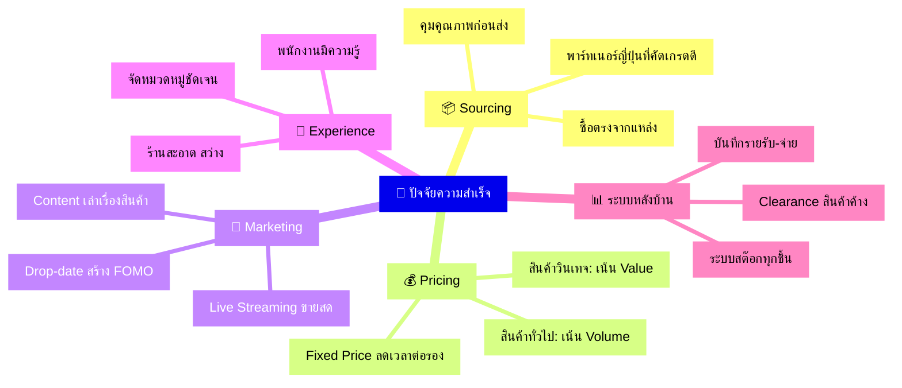

---

## 3. แผนการเงินและผลประกอบการ

### 3.1 โครงสร้างต้นทุน

#### ต้นทุนคงที่ (Fixed Costs) ต่อเดือน
| รายการ | จำนวน (บาท) | หมายเหตุ |
|--------|-------------|---------|
| ค่าเช่า 2 ห้อง | 30,000 | มีที่พักข้างบน มีห้องมีแอร์ |
| เงินเดือนพนักงาน 2 คน | 18,000 | คนละ 9,000 บาท |
| ค่าน้ำ-ไฟ-อินเทอร์เน็ต | 6,000 | เผื่อค่าไฟแอร์ |
| ค่าการตลาด/โฆษณา | 7,000 | FB Ads + TikTok Ads |
| ค่าใช้จ่ายเบ็ดเตล็ด | 3,000 | อุปกรณ์, บรรจุภัณฑ์, อื่นๆ |
| **รวมต้นทุนคงที่** | **64,000** | |

#### ต้นทุนผันแปร (Variable Costs)
| รายการ | สัดส่วน | หมายเหตุ |
|--------|---------|---------|
| ต้นทุนสินค้า (COGS) | ~45% ของยอดขาย | ต้นทุนเฉลี่ย ฿50/ชิ้น, ขายเฉลี่ย ~฿110/ชิ้น |
| ค่าส่งสินค้า | ลูกค้าจ่าย | J&T ลูกค้ารับผิดชอบ |
| ค่าธรรมเนียมแพลตฟอร์ม | 3-5% | Shopee, TikTok Shop |

### 3.2 ผลประกอบการ 3 Scenarios

```mermaid
xychart-beta
    title "ผลประกอบการรายเดือน 3 Scenarios (บาท)"
    x-axis ["Conservative", "Moderate", "Aggressive"]
    y-axis "บาท" -30000 --> 200000
    bar [100000, 150000, 200000]
    bar [55000, 82500, 110000]
    bar [-9000, 18500, 46000]
```

#### Scenario A: Conservative (เป้าหมาย เดือน 1-3)
| รายการ | จำนวน (บาท) |
|--------|-------------|
| ยอดขาย | 100,000 |
| ต้นทุนสินค้า (45%) | -45,000 |
| **กำไรขั้นต้น** | **55,000** |
| ต้นทุนคงที่ | -64,000 |
| **กำไรสุทธิ** | **-9,000** ❌ |

#### Scenario B: Moderate (เป้าหมาย เดือน 4-6)
| รายการ | จำนวน (บาท) |
|--------|-------------|
| ยอดขาย | 150,000 |
| ต้นทุนสินค้า (45%) | -67,500 |
| **กำไรขั้นต้น** | **82,500** |
| ต้นทุนคงที่ | -64,000 |
| **กำไรสุทธิ** | **+18,500** ✅ |

#### Scenario C: Aggressive (เป้าหมาย เดือน 7-12)
| รายการ | จำนวน (บาท) |
|--------|-------------|
| ยอดขาย | 200,000 |
| ต้นทุนสินค้า (45%) | -90,000 |
| **กำไรขั้นต้น** | **110,000** |
| ต้นทุนคงที่ | -64,000 |
| **กำไรสุทธิ** | **+46,000** ✅✅ |

### 3.3 Break-even Analysis

> [!IMPORTANT]
> **จุดคุ้มทุน (Break-even) = ฿116,364/เดือน**
> ต้นทุนคงที่ ฿64,000 ÷ Gross Margin 55% = ฿116,364

```
ถ้ายอดขาย...
  ฿80,000  → ขาดทุน ฿20,000/เดือน ❌
  ฿100,000 → ขาดทุน ฿9,000/เดือน  ❌
  ฿116,364 → เท่าทุน พอดี           ⚖️
  ฿130,000 → กำไร ฿7,500/เดือน     ✅
  ฿150,000 → กำไร ฿18,500/เดือน    ✅✅
  ฿200,000 → กำไร ฿46,000/เดือน    ✅✅✅
```

### 3.4 ประมาณการยอดขายรายปี

| เดือน | ยอดขาย | กำไรสุทธิ | หมายเหตุ |
|-------|--------|----------|---------|
| เดือน 1 | 80,000 | -20,000 | เพิ่งเปิด สร้างฐานลูกค้า |
| เดือน 2 | 90,000 | -14,500 | เริ่มไลฟ์ขาย |
| เดือน 3 | 100,000 | -9,000 | ยังขาดทุน ต้องอัดโปรโมท |
| เดือน 4 | 120,000 | +2,000 | ✅ **Break-even!** ตลาดนัด + TikTok |
| เดือน 5 | 130,000 | +7,500 | Shopee เริ่มมียอด |
| เดือน 6 | 150,000 | +18,500 | หลายช่องทางทำงานพร้อมกัน |
| เดือน 7-12 | 150,000-200,000 | +18,500-46,000 | เติบโตต่อเนื่อง |
| **รวมปีที่ 1** | **~฿1,620,000** | **~฿+178,000** | |

---

## 4. กลยุทธ์ลดต้นทุน

### 4.1 ตารางเปรียบเทียบ: ถ้าลดต้นทุนได้ กำไรเพิ่มขึ้นเท่าไหร่

| กลยุทธ์ | ลดต้นทุน/เดือน | กำไรเพิ่ม/ปี | ระดับยาก |
|---------|---------------|-------------|---------|
| ลดขนาดการสั่งสินค้า (5 ตัน แทน 10 ตัน) | ฿5,000 | ฿60,000 | ⭐⭐ |
| เจรจาค่าเช่าลง 10% | ฿2,000 | ฿24,000 | ⭐ |
| เพิ่มสัดส่วนสินค้ามูลค่าสูง (ของสะสม/เฟอร์นิเจอร์) | ลด COGS 5% | ฿90,000 | ⭐⭐⭐ |
| ทำความสะอาด + เพิ่มมูลค่าสินค้า (Regenerating Value) | เพิ่มราคาขาย 30% | ฿180,000 | ⭐⭐ |
| Clearance สินค้าค้าง > 3 เดือน | คืนเงินทุน ฿10,000+ | ฿120,000 | ⭐ |

### 4.2 Flowchart กลยุทธ์ลดต้นทุน

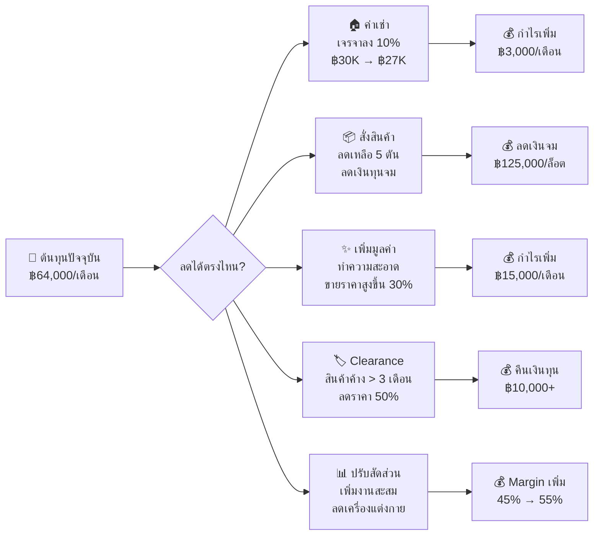

### 4.3 สูตร Regenerating Value (เรียนรู้จาก Treasure Factory)

| ขั้นตอน | รายละเอียด | ผลลัพธ์ |
|---------|-----------|---------|
| 1. รับสินค้า | ซื้อมาราคา ฿50 | ต้นทุน ฿50 |
| 2. ทำความสะอาด | ล้าง ขัด เช็ด (ใช้เวลา 10 นาที) | ต้นทุนเพิ่ม ฿5 |
| 3. ถ่ายรูปสวย | แสงดี ฉากสวย ถ่ายหลายมุม | ต้นทุนเพิ่ม ฿0 |
| 4. เล่าเรื่องราว | ที่มา ยุค ยี่ห้อ ความหายาก | เพิ่มมูลค่าทางจิตใจ |
| 5. **ขาย** | ราคา ฿150-300 แทน ฿100 | **Margin 63-83%** |

> [!TIP]
> **ทำความสะอาดสินค้า 10 นาที = เพิ่มกำไร 30-50% ต่อชิ้น** 
> นี่คือเคล็ดลับของ Treasure Factory ที่ทำ Gross Margin ได้ถึง 65%

---

## 5. คู่มือปฏิบัติงาน — ผู้ประกอบการ

### 5.1 ตารางงานรายวัน

| เวลา | งาน | รายละเอียด |
|------|-----|-----------|
| 08:00-09:00 | เตรียมเปิดร้าน | เช็คออเดอร์ออนไลน์, จัดส่งสินค้า |
| 09:00-10:00 | ตรวจสอบสต๊อก | เช็คยอดขายเมื่อวาน, อัพเดทสินค้า |
| 10:00-12:00 | ถ่ายรูป/โพสต์สินค้าใหม่ | ลงเว็บ, FB, Shopee, TikTok |
| 12:00-13:00 | พักเที่ยง | |
| 13:00-15:00 | จัดการร้าน/รับลูกค้า | ต่อราคา, ให้ข้อมูล, ปิดการขาย |
| 15:00-16:00 | ทำ Content / เตรียมไลฟ์ | จัดเรียงสินค้าสำหรับไลฟ์ |
| 16:00-18:00 | Facebook/TikTok Live | ไลฟ์ขายสินค้า (อย่างน้อย 2-3 ครั้ง/สัปดาห์) |
| 18:00 | สรุปยอดขายประจำวัน | บันทึกรายรับ-จ่าย |

### 5.2 ตารางงานรายสัปดาห์

| วัน | งานพิเศษ |
|-----|---------|
| จันทร์ | วางแผนสัปดาห์ + ตรวจสต๊อก |
| อังคาร | ถ่ายรูปสินค้าใหม่ |
| พุธ | อัพเดทเว็บไซต์ + Shopee |
| พฤหัสบดี | Facebook Live (รอบเย็น) |
| ศุกร์ | TikTok Live + เตรียมของตลาดนัด |
| เสาร์ | **ออกตลาดนัด** (เดือนละ 2-4 ครั้ง) |
| อาทิตย์ | **ออกตลาดนัด** + สรุปยอดรายสัปดาห์ |

### 5.3 ตารางงานรายเดือน

| สัปดาห์ | งาน |
|---------|-----|
| สัปดาห์ 1 | สรุปยอดเดือนที่แล้ว, วางแผนโปรโมชั่นเดือนนี้ |
| สัปดาห์ 2 | ตรวจสต๊อกแบบ Full Count, จัด Clearance สินค้าค้าง |
| สัปดาห์ 3 | ประเมินผลการตลาด, ปรับกลยุทธ์โฆษณา |
| สัปดาห์ 4 | วางแผนสั่งสินค้ารอบถัดไป, สรุปผลประกอบการ |

### 5.4 Flowchart การตัดสินใจผู้ประกอบการ

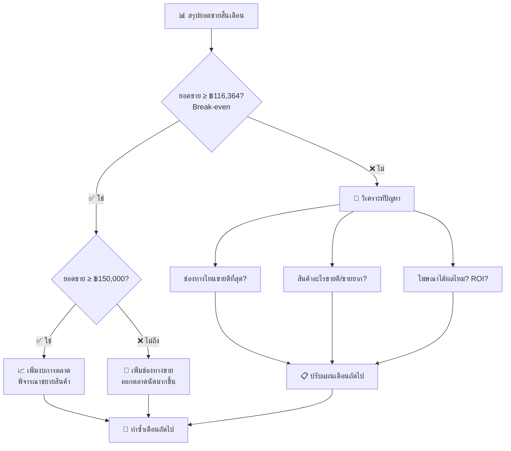

---

## 6. คู่มือปฏิบัติงาน — พนักงาน

### 6.1 หน้าที่ความรับผิดชอบ

#### พนักงาน A: ดูแลหน้าร้าน + ออนไลน์
| งาน | รายละเอียด | เวลา |
|-----|-----------|------|
| เปิด-ปิดร้าน | 09:00-18:00 | ทุกวัน |
| ต้อนรับลูกค้า | แนะนำสินค้า, ตอบคำถาม | ตลอดวัน |
| ถ่ายรูปสินค้า | แสงธรรมชาติ มุม 45°/90° | 10:00-12:00 |
| โพสต์ลง Social Media | FB, TikTok, Shopee | 12:00-13:00 |
| จัดส่งสินค้าออนไลน์ | แพ็ค + ส่ง J&T | เมื่อมีออเดอร์ |

#### พนักงาน B: ดูแลสต๊อก + ทำความสะอาด
| งาน | รายละเอียด | เวลา |
|-----|-----------|------|
| รับสินค้าใหม่ | แกะ ตรวจสอบ คัดแยก | เมื่อของมาถึง |
| ทำความสะอาดสินค้า | ล้าง ขัด เช็ด ติดป้าย | 09:00-12:00 |
| จัดเรียงร้าน | จัดตามหมวดหมู่ ทำความสะอาดร้าน | 13:00-14:00 |
| บันทึกสต๊อก | ลงรายการสินค้าเข้า-ออก | ตลอดวัน |
| เตรียมของตลาดนัด | คัดสินค้า + จัดกล่อง | ศุกร์เย็น |

### 6.2 มาตรฐานการถ่ายรูปสินค้า

> [!NOTE]
> **หลักการ:** ถ่ายให้สวย แต่ต้องซื่อสัตย์ — โชว์ตำหนิทุกจุดเพื่อสร้างความเชื่อมั่น

| หัวข้อ | มาตรฐาน |
|--------|---------|
| **แสง** | แสงธรรมชาติใกล้หน้าต่าง (เช้า 7-9 น. หรือ บ่าย 16-18 น.) |
| **ฉากหลัง** | ขาว/ครีม/พื้นไม้ หรือผ้าลินิน |
| **มุมกล้อง** | จาน/ชาม = 90° (Top View), แก้ว/ของสูง = 45° |
| **จำนวนรูป** | อย่างน้อย 4 รูป: ภาพรวม, ด้านบน, ด้านข้าง, ตำหนิ (ถ้ามี) |
| **พร็อพ** | ดอกไม้แห้ง, ช้อนส้อม (ไม่รก) |
| **ห้าม** | ❌ ใช้แฟลช ❌ ฉากรก ❌ ปกปิดตำหนิ |

### 6.3 การตั้งราคาสินค้า

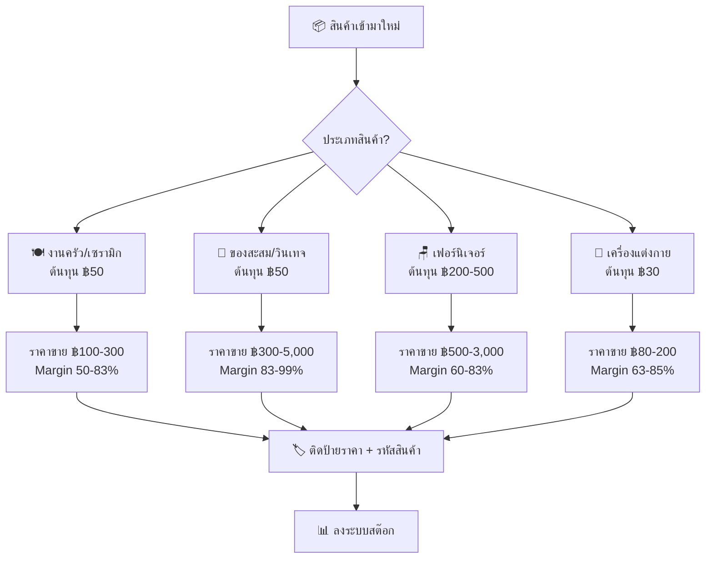

### 6.4 สิ่งที่พนักงานต้องรู้เกี่ยวกับสินค้าญี่ปุ่น

| หัวข้อ | ความรู้ที่ต้องมี |
|--------|-----------------|
| **เซรามิก** | รู้จักยี่ห้อ/แหล่งผลิต: Arita-yaki, Mino-yaki, Kutani-yaki, Seto-yaki |
| **ของสะสม** | รู้จักตลาด: Nendoroid, Gunpla, Figma, Chogokin — ดูมูลค่าจาก Mandarake/Yahoo Auctions |
| **เครื่องครัว** | รู้จักแบรนด์: Sori Yanagi, Ikenaga, Tiger, Zojirushi |
| **กล้อง** | รู้จักรุ่น: Canon, Nikon, Pentax, Olympus — ตรวจสภาพเลนส์ + เชื้อรา |
| **ดูของแท้** | ตราประทับ (刻印), สติกเกอร์, น้ำหนัก, คุณภาพงาน |

### 6.5 การรับมือกับลูกค้า

| สถานการณ์ | วิธีจัดการ |
|-----------|----------|
| ลูกค้าต่อราคา | ลดได้ 10-15% สูงสุด หรือเสนอ Bundle Deal |
| ลูกค้าถามเรื่องสินค้า | เล่าเรื่องราว ที่มา ยุค (ถ้าไม่รู้ให้บอกตรงๆ) |
| ลูกค้าร้องเรียน | ขอโทษ + เสนอคืนเงิน/เปลี่ยนสินค้า |
| ลูกค้า walk-in | ทักทาย → ปล่อยให้ดู → เข้าไปช่วยเมื่อเห็นสนใจ |
| สินค้าแตกในร้าน | บันทึก + รายงานเจ้าของ (ไม่หักเงิน ถ้าเป็นอุบัติเหตุ) |

---

## 7. แผนการตลาดและโฆษณา

### 7.1 ช่องทางและงบประมาณ

| ช่องทาง | งบ/เดือน | เป้าหมาย | KPI |
|---------|---------|---------|-----|
| Facebook Ads | ฿3,000 | สร้างการรับรู้ + ดึงคนดูไลฟ์ | ROAS ≥ 3x |
| TikTok Ads | ฿2,000 | เข้าถึง Gen Y/Z | Views + ยอดขายผ่าน Live |
| Shopee Ads | ฿1,000 | เพิ่ม visibility | Click + Conversion |
| LINE OA | ฿1,000 | รักษาลูกค้าเก่า | Repeat Purchase Rate |
| **รวม** | **฿7,000** | | |

### 7.2 Content Strategy รายสัปดาห์

| วัน | Content | ช่องทาง |
|-----|---------|---------|
| จันทร์ | "สินค้ามาใหม่ประจำสัปดาห์" + รูปสวย 5-10 ชิ้น | FB + IG |
| อังคาร | วิดีโอ "เปิดกล่องสินค้าใหม่" (Unboxing) | TikTok |
| พุธ | เล่าเรื่องสินค้า "คุณรู้ไหม? จานใบนี้มาจาก..." | FB |
| พฤหัสบดี | **Facebook Live ขายของ** 16:00-18:00 | FB Live |
| ศุกร์ | Preview สินค้าสำหรับตลาดนัดวันเสาร์ | TikTok + FB |
| เสาร์ | Live สดจากตลาดนัด + รูปบรรยากาศร้าน | TikTok Live |
| อาทิตย์ | รีวิวจากลูกค้า + โปรโมชั่นสัปดาห์หน้า | FB + LINE |

### 7.3 เทคนิค Facebook Live ที่ได้ผล

| ขั้นตอน | เวลา | ทำอะไร |
|---------|------|--------|
| เปิดไลฟ์ | 0-5 นาที | ทักทาย แจ้งไฮไลท์สินค้าวันนี้ "วันนี้มีจานเซรามิกสวย 5 ใบ!" |
| กลางไลฟ์ | 5-90 นาที | โชว์ทีละชิ้น เล่าเรื่อง บอกราคา โชว์ตำหนิ |
| Flash Deal | ทุก 30 นาที | ลดราคาพิเศษ 3 นาที สร้าง FOMO |
| ปิดไลฟ์ | ท้ายๆ | Bundle Deal ซื้อ 3 ชิ้นลดพิเศษ + แจกของรางวัล |

### 7.4 เทคนิค TikTok ที่ได้ผล

| เทคนิค | รายละเอียด |
|--------|-----------|
| **LIVE GMV Max** | ยิงแอดเข้าถึงคนที่ "พร้อมซื้อ" |
| **Door-Buster** | 5 นาทีแรกต้องเปิดด้วยสินค้าเด็ด |
| **Teaser ก่อนไลฟ์** | ถ่ายคลิปสั้น 15 วิ "เย็นนี้มีของดีมาลงนะ 🌸" |
| **Highlight หลังไลฟ์** | ตัดช่วงพีคมาทำวิดีโอสั้น |
| **Storytelling** | เล่าเรื่องราว + ความบันเทิง = Emotional Commerce |

### 7.5 วิธีวัดผลโฆษณา

| ตัวชี้วัด | ค่าเป้าหมาย | ค่าเฉลี่ยตลาด |
|----------|------------|--------------|
| ROAS (Return on Ad Spend) | ≥ 3x | 2-3x |
| Cost per Message | ≤ ฿15 | ฿5-30 |
| Cost per Purchase | ≤ ฿200 | ฿100-500 |
| CTR (Click-Through Rate) | ≥ 2% | 1-3% |

> [!TIP]
> **เคล็ดลับ:** ทดสอบโฆษณาต่อเนื่อง 6-7 วันก่อนประเมินผล ถ้าแคมเปญไหนดี ค่อยๆ เพิ่มงบทีละ 20-30% ทุก 3-4 วัน

---

## 8. แผนการออก Event / ตลาดนัด

### 8.1 ตลาดนัดที่แนะนำ (เรียงตามความเหมาะสม)

#### ใกล้ร้าน (ปทุมธานี) — แนะนำเริ่มที่นี่ก่อน
| ตลาด | ค่าเช่า | ข้อดี |
|------|---------|------|
| **Meet Market** (หน้ามาร์เก็ตวิลเลจ คลอง 4) | ฿140-200/วัน | 🏆 **ใกล้ร้านที่สุด!** เปิดพฤหัส-ศุกร์ |
| ตลาดรังสิต | ฿120/วัน | ตลาดใหญ่ มีที่จอดรถ |
| ตลาดสัมมากรเมืองเอก | ฿100/วัน | ฐานลูกค้าชุมชน + นักศึกษา ม.รังสิต |

#### กรุงเทพฯ — ขยายเมื่อพร้อม
| ตลาด | ค่าเช่า | ข้อดี |
|------|---------|------|
| ตลาดปัฐวิกรณ์ (นวมินทร์ 72) | ฿330/วัน | แหล่งรวมร้านมือสองญี่ปุ่นใหญ่สุด |
| ตลาดนัดรถไฟ ศรีนครินทร์ | ฿300/วัน | มีโซนวินเทจโดยเฉพาะ |
| ตลาดเลียบด่วน รามอินทรา | ฿300-400/วัน | ตลาดกลางคืน ขนาดใหญ่ |

### 8.2 ต้นทุนการออกร้าน (ต่อครั้ง)

| รายการ | ค่าใช้จ่าย |
|--------|----------|
| ค่าเช่าพื้นที่ | ฿100-400 |
| ค่าน้ำมัน/ขนส่ง | ฿200-500 |
| ค่าอาหาร/เครื่องดื่ม | ฿200 |
| ค่าอุปกรณ์ (เต็นท์/โต๊ะ) | ฿0 (ซื้อครั้งเดียว) |
| **รวม** | **฿500-1,100/ครั้ง** |

### 8.3 เป้าหมายยอดขายต่อครั้ง

| ระดับ | ยอดขาย | กำไร (หลังหักค่าใช้จ่าย) |
|-------|--------|--------------------------|
| ต่ำสุด (Break-even) | ฿2,000 | ฿0 |
| ปกติ | ฿5,000-8,000 | ฿3,000-5,000 |
| ดีมาก | ฿10,000+ | ฿7,000+ |

> [!IMPORTANT]
> **งาน Japan Event ใหญ่ๆ** (NIPPON HAKU ฿85,000-107,000, Japan Expo ต้องสอบถาม) — **ค่าบูธแพงมาก ยังไม่เหมาะกับตอนนี้**
> แนะนำเริ่มจากตลาดนัดท้องถิ่นก่อน พอยอดขายเพิ่มค่อยพิจารณา

---

## 9. Checklist ก่อนเปิดร้าน

### Flowchart ขั้นตอนก่อนเปิดร้าน

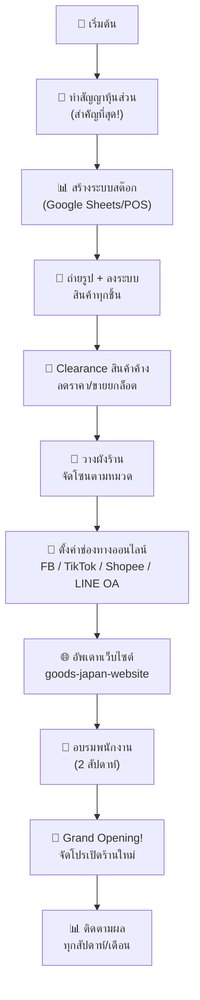

### Checklist รายละเอียด

#### 🔴 ด่วนมาก (ทำก่อนเปิดร้าน)
- [ ] ทำสัญญาหุ้นส่วนเป็นลายลักษณ์อักษร
- [ ] สร้างระบบจัดการสต๊อก (Google Sheets / แอป)
- [ ] ถ่ายรูปสินค้าทุกชิ้น ติดรหัส ลงระบบ
- [ ] จัด Clearance สินค้าค้าง > 3 เดือน
- [ ] เปิดบัญชีธนาคารร่วม (สำหรับธุรกิจ)
- [ ] ทำบัญชีรายรับ-รายจ่ายในระบบเดียวกัน

#### 🟡 สำคัญ (ทำภายในสัปดาห์แรก)
- [ ] วางผังร้าน จัดโซนตามหมวดหมู่
- [ ] สร้าง LINE OA + Rich Menu
- [ ] อัพเดทเว็บไซต์ Goods Japan บน GitHub Pages
- [ ] จัดตารางไลฟ์ FB/TikTok ประจำสัปดาห์
- [ ] อบรมพนักงาน (ถ่ายรูป, โพสต์, ดูแลลูกค้า)
- [ ] สมัคร TikTok Shop + Shopee

#### 🟢 ปกติ (ทำภายในเดือนแรก)
- [ ] สำรวจตลาดนัดใกล้ร้าน (Meet Market คลอง 4)
- [ ] ลงทะเบียนออกร้านตลาดนัด 1-2 แห่ง
- [ ] ทำ Grand Opening โปรโมชั่นเปิดร้าน
- [ ] จัดทำ Loyalty Program (บัตรสะสมแต้ม LINE)
- [ ] หาพันธมิตร (ร้านกาแฟ, ร้านอาหารญี่ปุ่น)

---

## 10. ข้อตกลงหุ้นส่วน

> [!CAUTION]
> **ต้องทำเป็นลายลักษณ์อักษร ก่อนลงเงิน ก่อนเปิดร้าน**

### หัวข้อที่ต้องตกลงกัน

| หัวข้อ | คำถามที่ต้องตอบ |
|--------|----------------|
| **1. สัดส่วนหุ้น** | ใครลงเงินเท่าไหร่? แบ่งหุ้นกี่ % ? |
| **2. การลงทุน** | เงินลงทุนเริ่มต้นรวมเท่าไหร่? ใครจ่ายส่วนไหน? |
| **3. แบ่งกำไร/ขาดทุน** | แบ่งตามสัดส่วนหุ้น? หรือมีรูปแบบอื่น? |
| **4. อำนาจตัดสินใจ** | การตัดสินใจใหญ่ (> ฿50,000) ต้องเห็นพ้องกันทั้ง 2 ฝ่ายหรือไม่? |
| **5. หน้าที่** | ใครดูแล Sourcing? ใครดูแล Marketing? ใครดูแลการเงิน? |
| **6. เงินเดือนผู้บริหาร** | ถ้าทำงานเต็มเวลาในร้าน มีเงินเดือนหรือไม่? เท่าไหร่? |
| **7. Exit Strategy** | ถ้าต้องการออก ขายหุ้นให้ใคร? ราคาเท่าไหร่? |
| **8. เงื่อนไขยกเลิก** | ขาดทุนต่อเนื่องกี่เดือนถึงจะหยุด? (หุ้นส่วนบอก 2-3 ปี) |
| **9. ทรัพย์สินเมื่อเลิก** | สินค้า อุปกรณ์ ลูกค้า แบ่งยังไง? |
| **10. การเพิ่มทุน** | ถ้าต้องเพิ่มทุน ทำยังไง? ฝ่ายที่ไม่เพิ่มถูก dilute หรือไม่? |

---

## 11. การจัดการความเสี่ยง

### Risk Matrix

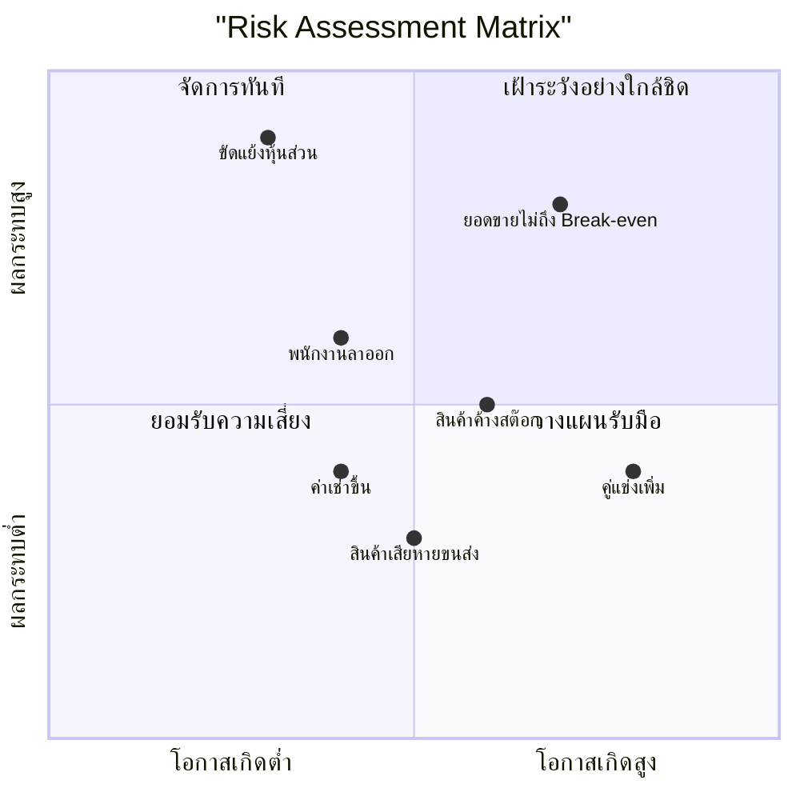

### แผนรับมือความเสี่ยง

| ความเสี่ยง | โอกาส | ผลกระทบ | แผนรับมือ |
|-----------|-------|---------|----------|
| ยอดขายไม่ถึง Break-even | สูง | สูงมาก | เพิ่มช่องทางขาย, ออกตลาดนัด, เพิ่มงบโฆษณา |
| สินค้าค้างสต๊อก | ปานกลาง | ปานกลาง | Clearance ทุก 3 เดือน, ลดขนาดออเดอร์ |
| คู่แข่งเพิ่ม | สูง | ปานกลาง | สร้างความแตกต่าง, ความเชี่ยวชาญ, Community |
| พนักงานลาออก | ปานกลาง | สูง | จ่ายตรงเวลา, สอนงานคู่กัน, บรรยากาศดี |
| ขัดแย้งหุ้นส่วน | ต่ำ | สูงมาก | **สัญญาหุ้นส่วนที่ชัดเจน** + ประชุมทุกเดือน |
| สินค้าเสียหายจากขนส่ง | ปานกลาง | ต่ำ | แพ็คอย่างดี, ประกันสินค้าชิ้นแพง |
| ค่าเช่าขึ้น | ปานกลาง | ปานกลาง | ทำสัญญาเช่าระยะยาว 2-3 ปี |

### แผนสำรอง (Plan B)

> ถ้าขาดทุนต่อเนื่อง 6 เดือนขึ้นไป:

| ระดับ | เงื่อนไข | การดำเนินการ |
|-------|---------|-------------|
| ⚠️ เฝ้าระวัง | ขาดทุน 3 เดือนติดต่อกัน | วิเคราะห์ + ปรับกลยุทธ์ |
| 🟡 ปรับโครงสร้าง | ขาดทุน 6 เดือน | ลดพื้นที่เช่า, ลดพนักงาน, เน้นออนไลน์ |
| 🔴 Plan B | ขาดทุน 12 เดือน+ | ขายส่งยกตู้คอนเทนเนอร์ (แผนหุ้นส่วน) |
| ⛔ Exit | ขาดทุนสะสม > ฿300,000 | ปิดร้าน, แบ่งทรัพย์สินตามสัญญา |

---

## 12. แผนผังร้านและทำเลที่ตั้ง

### 12.1 ข้อมูลอาคาร

ร้านตั้งอยู่ในอาคารพาณิชย์ ถนนเลียบคลองสี่ ใกล้แยกวงแหวน-รังสิต ปทุมธานี

| รายละเอียด | ข้อมูล |
|-----------|-------|
| ประเภทอาคาร | อาคารพาณิชย์ 3 ชั้น |
| จำนวนคูหา | 2 คูหา (ซ้ายสุด) |
| ค่าเช่า | ฿15,000/คูหา/เดือน |
| สิ่งอำนวยความสะดวก | มีที่พักชั้นบน มีแอร์ |
| ร้านข้างเคียง | ร้านค้าปลีก, MR.DIY |
| ที่จอดรถ | บริเวณหน้าอาคาร (จอดได้ 3-4 คัน) |

### 12.2 ขนาดพื้นที่ต่อคูหา

| รายการ | ขนาด |
|--------|------|
| หน้ากว้าง | 4 เมตร |
| ความลึก | 12-16 เมตร |
| พื้นที่ใช้สอย | 48-64 ตร.ม. |
| ใต้กันสาดหน้าร้าน | กว้าง 4 x ลึก 4-5 เมตร |

> [!TIP]
> **ข้อดีของพื้นที่ขนาดกะทัดรัด:** ร้านของมือสองที่พื้นที่ไม่ใหญ่เกินไป จะทำให้ของดู "แน่นและเยอะ" กระตุ้นความรู้สึก "Treasure Hunt" (อยากรื้อหาของดี) ของลูกค้าได้ดีกว่าร้านกว้างๆ แต่ของโหรงเหรง

### 12.3 การจัดโซนภายในร้าน (Store Layout)

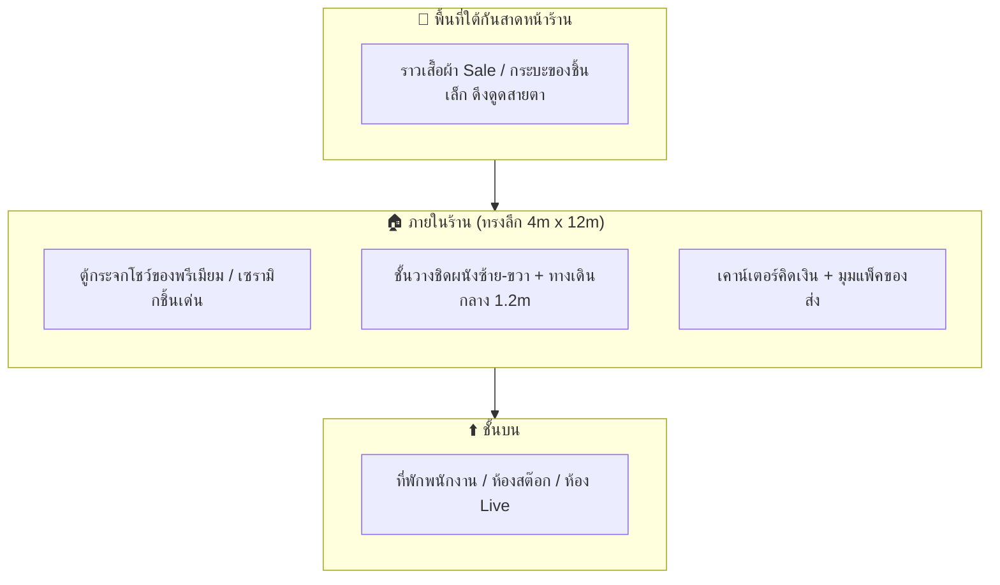

### 12.4 คำแนะนำการตกแต่งร้าน

| หัวข้อ | คำแนะนำ |
|--------|---------|
| ประตูหน้าร้าน | ใช้ประตูกระจกใส ให้คนข้างนอกมองเห็นของวินเทจภายใน ดึงดูดคนขับรถผ่าน |
| แสงสว่าง | ใช้ไฟ Warm White (เหลืองนวล) ทำให้เซรามิกและไม้ดูมีราคาขึ้น 30% |
| พื้นที่หน้าร้าน | วางกระบะ/ราวเสื้อผ้า Sale ราคาถูก สร้างความคึกคัก |
| ป้ายร้าน | ป้าย "Goods Japan" + ภาษาญี่ปุ่น "グッズ・ジャパン" ดูมีเอกลักษณ์ |

---

## 13. กลยุทธ์ระบายสินค้าค้างสต๊อก (Dead Stock Clearance)

### 13.1 ทำไมต้องระบายสินค้าค้าง?

สินค้าที่ค้างเกิน 3 เดือน (โดยเฉพาะเสื้อผ้า) จะ:
- กินพื้นที่ร้านที่ค่าเช่าแพง (฿15,000/คูหา)
- เงินทุนจม ไม่หมุนเวียน
- สินค้าเสื่อมสภาพ (เหม็นอับ, สีซีด)

### 13.2 ช่องทางระบายสินค้า

| ช่องทาง | ข้อดี | ข้อเสีย |
|---------|------|---------|
| **ตลาดนัด** (แนะนำ 🌟) | ค่าเช่าถูก (฿100-200), ตรงกลุ่มเป้าหมาย, มีไฟส่อง | ต้องขนของไป |
| เปิดท้ายรถกระบะ | ไม่เสียค่าเช่า | เสี่ยงเทศกิจ, ไม่มีที่บังแดดฝน |
| ขายยกล็อตให้ร้านค้าส่ง | ได้เงินก้อน, หมดปัญหาทีเดียว | ราคาต่ำมาก |
| ไลฟ์สด Flash Sale | ไม่ต้องขนของ | ค่าส่ง, ต้องมีฐานคนดู |

### 13.3 เทคนิคการขายในตลาดนัด

| เทคนิค | วิธีทำ | ผลลัพธ์ |
|--------|-------|--------|
| **ราคาเลขกลมๆ** | "ตัวละ 39.- / 3 ตัว 100.-" | ลูกค้าตัดสินใจซื้อง่าย ซื้อทีละหลายตัว |
| **รื้อกระบะ (Treasure Hunt)** | กองเสื้อผ้าในกระบะไม้ + ป้ายใหญ่ "นำเข้าจากญี่ปุ่นแท้ ทุกชิ้น 50.-" | คนมุงรื้อหาของ ยิ่งคนเยอะยิ่งดึงคนมาดู |
| **บุฟเฟ่ต์ถุง** | ให้ถุงพลาสติก 1 ใบ "ยัดได้เท่าไหร่ เอาไป ถุงละ 199.-" | ระบายของเร็วมาก + เป็น Content ไวรัลใน TikTok |

### 13.4 Cross-Selling กลับมาที่ร้านหลัก

> [!IMPORTANT]
> **อย่าปล่อยให้ลูกค้าซื้อของถูกแล้วจากไป ต้องดึงเขามาเป็นลูกค้าประจำของร้านใหญ่!**

- ทำป้ายไวนิลบอกชัดเจนว่ามาจากร้านไหน: **"Goods Japan ลดล้างสต๊อก! แวะดูของพรีเมียมได้ที่หน้าร้าน คลอง 4"**
- QR Code ตั้งบนโต๊ะ: **"แอด LINE หรือ Follow TikTok วันนี้ ลดเพิ่ม 10 บาท!"** เพื่อสร้างฐานติดตาม
- แจกนามบัตรร้านทุกถุง

---

## 14. การจัดการที่พักพนักงาน

### 14.1 ข้อมูลพนักงาน

| รายละเอียด | ข้อมูล |
|-----------|-------|
| จำนวน | 2 คน |
| เพศ | หญิง |
| อายุ | 20 ปี |
| เงินเดือน | คนละ 9,000 บาท |
| สวัสดิการหลัก | ที่พักฟรีชั้นบน (มีแอร์) |

### 14.2 กฎระเบียบที่พัก

> [!IMPORTANT]
> **ต้องตกลงกฎระเบียบเหล่านี้ "ก่อน" ที่พนักงานจะขนของย้ายเข้ามา**

| หัวข้อ | กฎระเบียบ |
|--------|-----------|
| ค่าน้ำ-ไฟเพิ่มสำหรับคนนอก | ถ้าแฟนมาอยู่ด้วย เก็บเพิ่ม ฿1,000-1,500/คู่/เดือน (หักจากเงินเดือน) |
| เก็บประวัติ | ขอสำเนาบัตรประชาชนแฟนของพนักงานไว้เป็นหลักฐาน (ร้านมีสินค้ามูลค่าสูง) |
| พื้นที่หวงห้าม | ห้ามแฟน/คนนอกลงมาป้วนเปี้ยนในพื้นที่หน้าร้าน/พื้นที่ขายของในเวลางาน |
| ห้ามพาคนนอกมาสังสรรค์ | ห้ามเชิญเพื่อนมากินเหล้า/ปาร์ตี้ในที่พักเด็ดขาด |
| ดึงมาเป็นประโยชน์ | วันที่ของลงตู้คอนเทนเนอร์ จ้างแฟนพนักงานมาช่วยยกของเป็นรายวัน |

### 14.3 ทางเลือกที่พัก

| ทางเลือก | รายละเอียด | ข้อดี |
|----------|-----------|------|
| **A: อยู่ชั้นบนร้าน (แนะนำ)** | พนักงานพักชั้นบน แฟนมาอยู่ได้แต่มีกฎและเก็บค่าไฟเพิ่ม | ประหยัด, พนักงานอยู่ใกล้ร้าน |
| B: เช่าหอพักข้างนอก | พนักงานไปเช่าหอแถว คลอง 4 (฿2,500-3,500/เดือน) | เจ้าของได้คืนพื้นที่ชั้นบนทำห้อง Live/สต๊อก |

---

## 15. วิเคราะห์กลุ่มลูกค้ารอบร้าน

### 15.1 ศักยภาพทำเล วงแหวน-รังสิต คลอง 4

โซนคลอง 4 เป็นทำเลที่มีหมู่บ้านจัดสรรหนาแน่นมากที่สุดแห่งหนึ่งในปทุมธานี มีทั้งบ้านเดี่ยว บ้านแฝด ทาวน์โฮม คอนโด หอพัก และอพาร์ทเม้นท์ กระจายตลอดเส้นถนนเลียบคลอง 4 ตั้งแต่ฝั่งธัญบุรี-รังสิต ไปจนจรดฝั่งลำลูกกา

> [!IMPORTANT]
> **ข้อได้เปรียบที่สำคัญที่สุดสำหรับร้าน Goods Japan:**
> หมู่บ้านจัดสรรใหม่ = **คนเพิ่งซื้อบ้าน เพิ่งย้ายเข้า** = ต้องการ **เฟอร์นิเจอร์ จานชาม ของแต่งบ้าน** ในราคาจับต้องได้!
> 
> สินค้ามือสองญี่ปุ่น (เฟอร์นิเจอร์ไม้ เซรามิก ของตกแต่ง) ตอบโจทย์กลุ่มคนเหล่านี้ได้พอดี:
> - **ราคาถูกกว่ามือหนึ่ง 50-80%** แต่คุณภาพดี
> - **ดีไซน์ญี่ปุ่นมินิมอล** เข้ากับบ้านสไตล์ Modern Japanese (เช่น MODEN จาก AP) ที่กำลังเป็นเทรนด์
> - **ไม่ซ้ำใคร** — ของมือสองทุกชิ้นมีเพียงชิ้นเดียว

### 15.2 รายชื่อหมู่บ้านและโครงการหลักรอบร้าน

#### 🏠 บ้านเดี่ยว & บ้านแฝด (ระดับราคา 3-8 ล้าน — กำลังซื้อสูง)

| โครงการ | เครือ | ระดับราคา | สินค้าที่น่าเสนอ |
|---------|-------|-----------|-----------------|
| **MODEN รังสิต-คลอง 4 วงแหวน** | AP Thailand | 4-6 ล. | เฟอร์นิเจอร์สไตล์ Japanese 🎯 |
| **Villaggio รังสิต-คลอง 4** | Land & Houses | 3-6 ล. | เฟอร์นิเจอร์ เซรามิก ของแต่งบ้าน |
| **ชัยพฤกษ์ 2 รังสิต-คลอง 4** | Land & Houses | 5-8 ล. | เฟอร์นิเจอร์หรู เซรามิกพรีเมียม |
| **แลนซีโอ คริป (Lanceo CRIB) วงแหวน-ลำลูกกา** | Lalin | 4-6 ล. | เฟอร์นิเจอร์ ของแต่งบ้าน |
| เดอะ วิลเลจ วงแหวน-รังสิต (The Village) | Areeya | 3-5 ล. | เฟอร์นิเจอร์ ของแต่งสวน |
| อินิซิโอ รังสิต-คลอง 4 (Inizio) | Land & Houses | 3-5 ล. | ของแต่งบ้าน จานชาม |
| ดิสคัฟเวอรี่ บาหลีไฮ (Discovery Balihai) | - | 3-5 ล. | ของแต่งบ้านสไตล์รีสอร์ท |
| ดิสคัฟเวอรี่ เพลส (Discovery Place) | - | 3-5 ล. | เฟอร์นิเจอร์ เซรามิก |
| S Ville รังสิต-ลำลูกกา คลอง 4 | - | 3-5 ล. | เฟอร์นิเจอร์ ของแต่งบ้าน |
| บ้านซื่อตรง รังสิต คลอง 4 | - | 2-4 ล. | จานชาม ของแต่งบ้าน |
| บ้านณัฐกานต์ คลอง 4 | - | 2-4 ล. | จานชาม ของแต่งบ้าน |
| สราญสิริ รังสิต | แสนสิริ | 5-8 ล. | เซรามิกพรีเมียม ของสะสม |
| กรีนวิลล์ (Greenville) | - | 2-4 ล. | เฟอร์นิเจอร์ จานชาม |
| เดอะ ริเวียร่า (The Riviera) | - | 3-5 ล. | ของแต่งบ้าน เซรามิก |
| บ้านสถาพร | - | 2-4 ล. | จานชาม ของใช้ในบ้าน |
| บ้านบุรีรมย์ รังสิต-ลำลูกกา คลอง 4 | Lalin | 3-5 ล. | เฟอร์นิเจอร์ ของแต่งบ้าน |

#### 🏘️ ทาวน์โฮม & บ้านแฝด (ระดับราคา 1.7-3 ล้าน — กำลังซื้อปานกลาง)

| โครงการ | เครือ | ระดับราคา | สินค้าที่น่าเสนอ |
|---------|-------|-----------|-----------------|
| **Pleno Town รังสิต คลอง 4 - วงแหวน** | AP Thailand | 2-3 ล. | จานชาม ของแต่งบ้านราคาดี |
| **เซนโทร รังสิต คลอง 4 - วงแหวน (Centro)** | AP Thailand | 2-3 ล. | เฟอร์นิเจอร์ชิ้นเล็ก |
| **พลีโน่ รังสิต คลอง 4 - วงแหวน (Pleno)** | AP Thailand | 2-3 ล. | ของแต่งบ้าน จานชาม |
| **Siri Town รังสิต-คลอง 4** | แสนสิริ | 2-3 ล. | ของแต่งบ้าน จานชาม |
| เดอะ คัลเลอร์ส วงแหวน-รังสิต (The Colors) | Areeya | 2-3 ล. | ของแต่งบ้าน เสื้อผ้า |
| เดอะ คัลเลอร์ส พรีเมียม (The Colors Premium) | Areeya | 2-3 ล. | ของแต่งบ้าน จานชาม |
| Lio BLISS รังสิต-คลอง 4 | Lalin | 1.7-2.5 ล. | จานชาม เสื้อผ้า จิปาถะ |
| Lio วงแหวน-ลำลูกกา คลอง 4 | Lalin | 1.7-2.5 ล. | จานชาม เสื้อผ้า |
| ไอลีฟ ไพร์ม วงแหวน-รังสิต คลอง 4 | - | 2-3 ล. | ของแต่งบ้าน จานชาม |
| เอ็มไลฟ์ ลำลูกกา-คลอง 4 | - | 2-3 ล. | จานชาม ของแต่งบ้าน |
| ยูนิโอ ทาวน์ ลำลูกกา คลอง 4 | - | 2-3 ล. | ของแต่งบ้าน จานชาม |
| พฤกษาวิลล์ รังสิต-คลอง 4 (Pruksa Ville) | Pruksa | 2-3 ล. | จานชาม ของแต่งบ้าน |
| เดอะ แพลนท์ รังสิต-คลอง 4 (The Plant) | Pruksa | 2-3 ล. | เฟอร์นิเจอร์ชิ้นเล็ก |
| บ้านพฤกษา (หลายเฟส) | Pruksa | 1.5-2.5 ล. | จานชาม เสื้อผ้า จิปาถะ |
| เพฟ รังสิต (Pave) | SC Asset | 2-3 ล. | ของแต่งบ้าน จานชาม |

#### 🏢 คอนโด & หอพัก (ค่าเช่า 2,500-7,000 บ./เดือน — กลุ่มเสื้อผ้า ของจุกจิก)

| โครงการ/ประเภท | ค่าเช่าเฉลี่ย | สินค้าที่น่าเสนอ |
|----------------|-------------|-----------------|
| เสนาคิทท์ รังสิต-คลอง 4 (คอนโด) | 6,000-7,200 | เซรามิกชิ้นเล็ก ของแต่งห้อง |
| หอพัก/อพาร์ทเม้นท์ แถวคลอง 4 (มากกว่า 50 แห่ง) | 2,500-4,000 | เสื้อผ้ามือสอง ของจุกจิก |
| หอพักนักศึกษา ม.ธรรมศาสตร์/ม.รังสิต | 2,800-4,500 | เสื้อผ้าวินเทจ กระเป๋า ของสะสม |

### 15.3 ประมาณการกำลังซื้อรอบร้าน

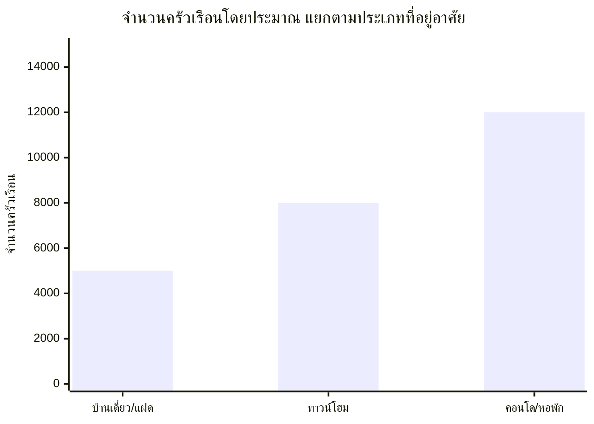

| ประเภท | จำนวนครัวเรือน (ประมาณ) | กำลังซื้อเฉลี่ย/ครั้ง | โอกาสซื้อ/ปี | มูลค่าตลาดรวม/ปี |
|--------|----------------------|---------------------|------------|-----------------|
| บ้านเดี่ยว/แฝด | ~5,000 | ฿500-3,000 | 2-4 ครั้ง | **฿5-60 ล้าน** |
| ทาวน์โฮม | ~8,000 | ฿200-1,000 | 2-3 ครั้ง | **฿3.2-24 ล้าน** |
| คอนโด/หอพัก | ~12,000 | ฿100-500 | 1-2 ครั้ง | **฿1.2-12 ล้าน** |
| **รวม** | **~25,000** | | | **฿9.4-96 ล้าน** |

> [!TIP]
> แค่ดึงลูกค้าจากกลุ่มนี้ได้ **1%** ก็ = ยอดขาย **฿94,000-960,000/ปี** แล้ว! ซึ่งตลาดมีขนาดใหญ่เกินพอสำหรับเป้าหมายยอดขาย ฿150,000/เดือน

### 15.4 กลุ่มลูกค้าเป้าหมายแยกตามความต้องการ

| กลุ่ม | สินค้าที่ต้องการ | วิธีเข้าถึง | ข้อได้เปรียบของ Goods Japan |
|-------|-----------------|------------|--------------------------|
| 🏠 **คนเพิ่งซื้อบ้านใหม่** | เฟอร์นิเจอร์ ชั้นวาง โต๊ะ ตู้ จานชาม ของแต่งบ้าน | FB Ads ปักหมุดรัศมีเส้นคลอง 4 | **ราคาถูกกว่า IKEA/HomePro 50-80%** ดีไซน์ญี่ปุ่นสวยกว่า |
| 🎓 **นักศึกษา ม.ธรรมศาสตร์/ม.รังสิต** | เสื้อผ้าวินเทจ กระเป๋า ของสะสม ฟิกเกอร์ | TikTok + ตลาดนัดหน้ามหาวิทยาลัย | **ของแท้จากญี่ปุ่น** ราคานักศึกษาซื้อได้ |
| ☕ **ร้านกาแฟ/ร้านอาหาร** | เซรามิก จานชาม แก้ว ของตกแต่งร้าน | LINE OA + ขายส่งราคาพิเศษ | **จานชามญี่ปุ่นแท้** ทำให้ร้านดูพรีเมียม ลูกค้าถ่ายรูปลงโซเชียล |
| 👨‍👩‍👧‍👦 **ครอบครัว** | ของเล่นเด็ก เครื่องครัว จิปาถะ | FB + หน้าร้าน walk-in | **ของเล่นญี่ปุ่นคุณภาพดี** ปลอดภัย ราคาย่อมเยา |
| 🔧 **ช่าง/ผู้รับเหมา** | เครื่องมือช่าง อุปกรณ์ | หน้าร้าน walk-in | **เครื่องมือญี่ปุ่นทนทาน** ราคาถูกกว่ามือหนึ่ง |

### 15.5 กลยุทธ์ Facebook Ads Location Targeting

> [!TIP]
> **วิธีใช้ข้อมูลหมู่บ้านทำโฆษณา:** นำชื่อหมู่บ้านเหล่านี้ไปตั้งค่า Location Targeting ใน FB Ads โดยปักหมุดรัศมี 3-5 กม. เฉพาะเส้นคลอง 4 จะดึงคนเข้าร้านหน้าร้านได้อย่างแม่นยำ
>
> **ข้อความโฆษณาตัวอย่าง:** *"เพิ่งย้ายเข้าบ้านใหม่? หาเฟอร์นิเจอร์สวยๆ ราคาดี ของแท้จากญี่ปุ่น มาที่ Goods Japan คลอง 4 ติด MR.DIY 🌸"*

---

## 16. แผนขยายกิจการระยะยาว

### 16.1 เป้าหมายการเติบโต

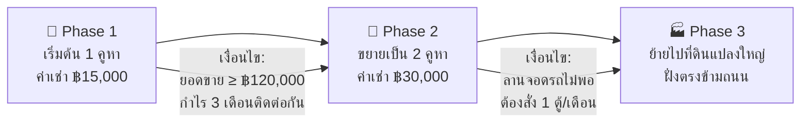

### 16.2 ปัจจัยตัดสินใจย้ายไปที่ดินแปลงใหญ่ (Phase 3)

| ปัจจัย | รายละเอียด |
|--------|----------|
| ทิศทางการจราจร | ต้องอยู่ฝั่ง "คนขับรถกลับบ้าน" (ช่วงเย็น) ลูกค้าแวะจอดซื้อของได้ง่าย |
| ต้นทุนก่อสร้าง | ต้องเทปูน ถมที่ เดินไฟ ทำหลังคา (หลักแสน-ล้าน) ต้องมีกำไรสะสมเพียงพอ |
| ลานจอดรถ | ข้อดีสำคัญ: ลูกค้าซื้อเฟอร์นิเจอร์ต้องใช้รถมาขน + รถคอนเทนเนอร์ถอยเข้าเทของได้ |
| ระบบสาธารณูปโภค | น้ำ ไฟ อินเทอร์เน็ต ต้องตรวจสอบว่าเข้าถึงหรือยัง |

### 16.3 สัญญาณที่บอกว่า "ถึงเวลาขยาย"

> [!IMPORTANT]
> **🚩 Trigger Points — เมื่อเห็นสัญญาณเหล่านี้ คือเวลาที่ต้องพิจารณาย้ายหรือขยาย:**

1. ของแน่นจนไม่มีทางเดิน ลูกค้าเริ่มบ่นว่าเดินชนของ
2. ลูกค้าบ่นบ่อยว่า **"อยากมานะ แต่หาที่จอดรถไม่ได้"**
3. ร้านสามารถระบายของเร็วถึงระดับที่ต้องสั่งของมาลงทีละ 1 ตู้คอนเทนเนอร์เต็มๆ ต่อเดือน
4. ยอดขายทะลุ ฿200,000/เดือน ติดต่อกัน 3 เดือนขึ้นไป

---

## 📎 ภาคผนวก

### A. สัดส่วนสินค้าที่แนะนำ (ปรับจากร้านเดิม)

| หมวด | ร้านเดิม | แนะนำใหม่ | เหตุผล |
|------|---------|----------|--------|
| งานครัว/เซรามิก | 30% | 25% | คงไว้ ขายได้ดี |
| **งานสะสม** | 10% | **20%** | ⬆️ ขายดีอันดับ 1 + Margin สูง |
| **เฟอร์นิเจอร์** | 10% | **15%** | ⬆️ ขายดีอันดับ 3 + ราคาสูง |
| แต่งบ้าน | 10% | 10% | คงเดิม |
| จิปาถะ | 10% | 10% | คงเดิม |
| เครื่องประดับ | 5% | 5% | คงเดิม |
| ของเล่น | 5% | 5% | คงเดิม |
| **เครื่องแต่งกาย** | 5% | **3%** | ⬇️ ค้างนาน 5 เดือน |
| **เครื่องมือช่าง** | 5% | **3%** | ⬇️ ตลาดเฉพาะเจาะจง |
| **เครื่องดนตรี** | 5% | **2%** | ⬇️ ตลาดเฉพาะเจาะจง |
| **กล้อง** | 5% | **2%** | ⬇️ ต้องมีความรู้เฉพาะ |

### B. แหล่งอ้างอิง

| แหล่ง | URL |
|-------|-----|
| OFM - กลยุทธ์ไลฟ์สด | ofm.co.th |
| Sellsuki - เทคนิคขาย FB | sellsuki.co.th |
| BangkokBank SME | bangkokbanksme.com |
| Thai Franchise Center | thaifranchisecenter.com |
| Japan Expo Thailand | japanexpothailand.com |
| Skooldio - การตลาดออนไลน์ | skooldio.com |

### C. เครื่องมือที่แนะนำ

| เครื่องมือ | ใช้ทำอะไร | ราคา |
|-----------|----------|------|
| Google Sheets | ระบบสต๊อก + บัญชี | ฟรี |
| Canva | ทำรูปโปรโมชั่น | ฟรี/Pro ฿329/เดือน |
| LINE OA | ดูแลลูกค้า | ฟรี (Basic) |
| CapCut | ตัดต่อวิดีโอ TikTok | ฟรี |
| Sellsuki / Page365 | ดูดคอมเมนต์ไลฟ์ | ฿599-999/เดือน |

---

> 📌 **เอกสารนี้จัดทำโดย AI Coach สำหรับร้าน Goods Japan (กูดส์ เจแปน)**
> อ้างอิงจากข้อมูลหุ้นส่วน + การวิจัยตลาด + กรณีศึกษาธุรกิจที่ประสบความสำเร็จ
> พร้อมให้คำปรึกษาเพิ่มเติมในทุกด้าน!
